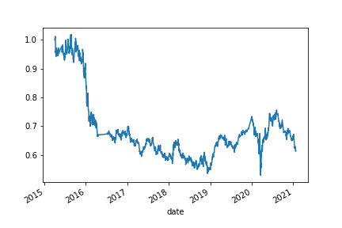
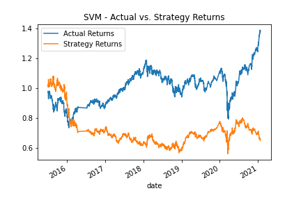
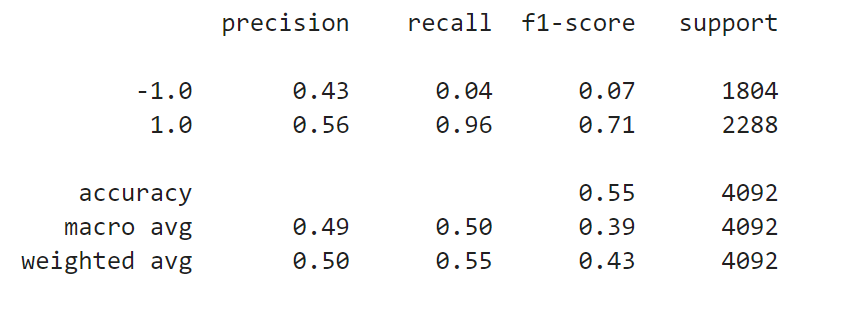
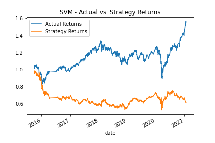
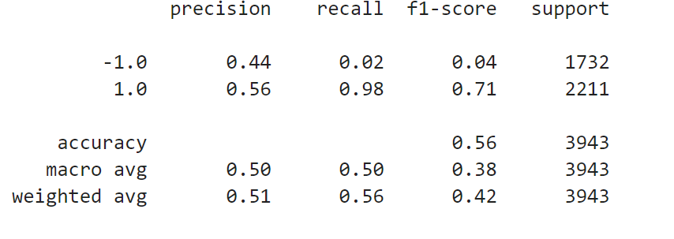
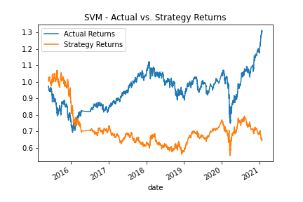
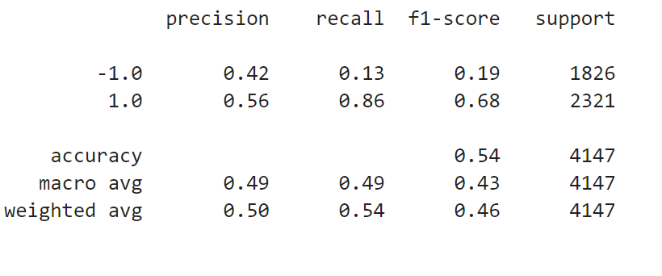
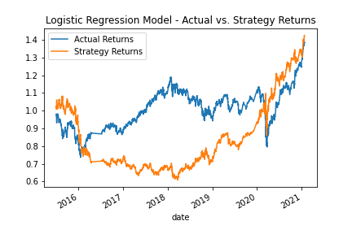
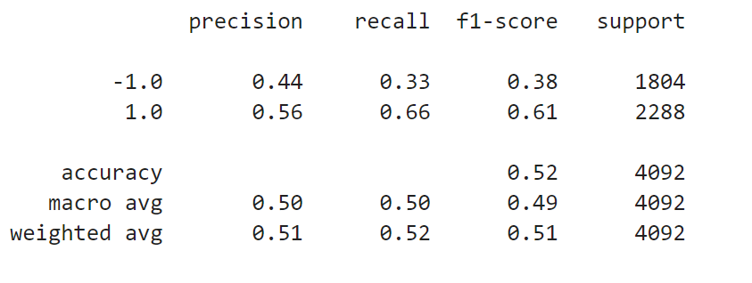

# Machine Learning Algo Trading
The purpose of this challenge is to find the optimal trading algorithm for the provided OHLCV dataset. In order to do so, we need to enhance the existing trading signals with machine learning algorithms that can adapt to new data. Then, we'll use backtesting to evaluate the performance of a trading algorithm based on historical stock pricing data. In this challenge, we start with the SVM model as a baseline and then finetune the model by first adjusting the size of the dataset and then by adjusting the SMA window length. We then compare the results. Next, we will evaluate another machine learning classifier. In this challenge, we use Logistic Regression. Finally, we will compare the performance of the multiple algorithm trading models over the same historical time period and document our findings.  

---

## Technologies

The credit risk resampling analysis leverages Python 3.8+ and utilizes the following project libraries and dependencies:
* [JupyterLab](https://jupyterlab.readthedocs.io/en/stable/) - a single integrated development environment (IDE) that allows you to write and run Python programs and review the results in one place
* [Pandas](https://pandas.pydata.org/) - a software library designed for open source data analysis and manipulation
* numpy
* pathlib
* hvplot
* matplotlib
* DateOffset
* sklearn - svm, train_test_split, StandardScaler, classification_report, LogisticRegression

---

## Installation Guide

Download Anaconda for your operating system and the latest Python version, run the installer, and follow the steps. Restart the terminal after completing the installation. Detailed instructions on how to install Anaconda can be found in the [Anaconda documentation](https://docs.anaconda.com/anaconda/install/).

---

## Usage
The analysis is hosted on the following GitHub repository at: https://github.com/nguyenthuyt/algo_trading   

### **Run instructions:**
To run this analysis, simply clone the repository or download the files and open the **machine_learning_trading_bot.ipynb** in Jupyter Lab.
___
## Establish a Baseline Performance

* SVM Model (Original):

The strategy returns from the SVM baseline trading algorithm performed well up until mid-2016. Subsequent to mid-2016 there was a huge difference between the strategy returns and actual returns and towards 2021 the actual vs. strategy returns started diverging greatly. The overall accuracy of the model is .55. The precision of the buy/sell prediction (1.0 and -1.0) were .56 and .43, respectively. With a recall of .96 for buy predictions of .96 and .04 for sell predictions, the model performed better at predicting buying long opportunities and failed to predict selling short opportunities.

## Tune the Baseline Trading Algorithm

* SVM Model (Tune 1 - Adjust size of training dataset from 3 months to 6 months):

What impact resulted from increasing or decreasing the training window?

In tuning the SVM model, the size of the dataset was adjusted to 6 months from 3 months originally. Precision, recall, f1-score, and accuracy stayed roughly the same. The results were slightly worse for the tuned SVM model as even the strategy returns did not perform as well as the original model prior to mid-2016.  

* SVM Model (Tune 2 - Adjust SMA long to 50):

What impact resulted from increasing or decreasing either or both of the SMA windows?

In tuning the SVM model, the SMA long window was adjusted to 50 days from 100 days originally. Recall for -1.0 predictions improved to .13 with 1.0 dropping to .86. Accuracy dropped to .54 from .55 The results were similar to the baseline model.  

## Evaluate a New Machine Learning Classifier

* LogisticRegression Model:

### Summary Evaluation Report

    Did this new model perform better or worse than the provided baseline model? Did this new model perform better or worse than your tuned trading algorithm?

    The logistic regression model performed better than the original SVM baseline model and the tuned algorithms. Precision stayed roughly the same and accuracy dropped slightly. However, recall and f1 score for the -1.0 predictions improved drastically to .33 and .38, respectively. For the period 2016 to 2020 the logistic regression model behaved similarly to the SVM model. However, subsequent to 2020 the strategy returns were moving in line with the actual returns and did not diverge like the SVM models. The logistic regression model proved to be the better trading algorithm. 

---

## Contributors

This project was created as part of the Rice Fintech Bootcamp 2022 Program by:

Thuy Nguyen

Email: nguyen_thuyt@yahoo.com

LinkedIn: nguyenthuyt

---

## License

MIT

